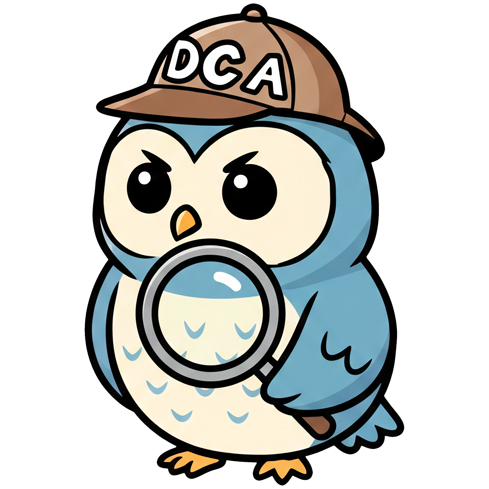

# Deep Competitive Analyst



The Deep Competitive Analyst is a 'deep agent' style LLM assistant built to automate the creation of company profiles and competitive analyses. Built on top of [deepagents](https://github.com/langchain-ai/deepagents), [LangGraph Platform](https://www.langchain.com/langgraph-platform), and [Perplexity Search](https://docs.perplexity.ai/getting-started/overview) the Deep Competitive Analyst can perform thorough research autonomously to create detailed business reports in a fraction of the time of a human.

# Installation

Deep Competitive Analyst relies on preview versions of LangChain, deepagents, and more. Setup and dependencies will be updated as these reliant capabilities are officially released.

1. Clone the repository:

```bash
git clone https://github.com/ALucek/deep-competitive-analyst.git
cd deep-competitive-analyst
```

2. Install depencies:

```bash
uv sync --prerelease allow
```

3. Create a .env file with the following variables:

```env
OPENAI_API_KEY=<your-api-key>
PERPLEXITY_API_KEY=<your-api-key>
LANGSMITH_API_KEY=<your-api-key>
LANGSMITH_TRACING=true
LANGSMITH_ENDPOINT=https://api.smith.langchain.com
LANGSMITH_PROJECT=deep_competitive_analyst
```

3. Launch the agent:

```bash
cd src
uv run --prerelease allow langgraph dev  
```

The Deep Competitive Analyst will now be running locally via the langgraph platform and can be integrated into your own compatible interface. It is recommended to use the [deep-agents-ui](https://github.com/langchain-ai/deep-agents-ui) for a quick local interface and local testing.

# Contributing

Contributions welcome! Feel free to submit a PR

Todo List:  
1. Standardize package versions pending official releases
2. Dedicated front end
3. File saving outside of state
4. Better filtering KWARGS for search tool
5. Test performance with different/smaller models
6. Human in the loop tool for clarifications from main system
7. Kickoff scope clarification
8. Conversation reconstruction from sub agent context for followup QnA
9. Better middleware management

# License

## License

Apache-2.0 License - See [LICENSE](LICENSE)

[](https://opensource.org/licenses/Apache-2.0)
